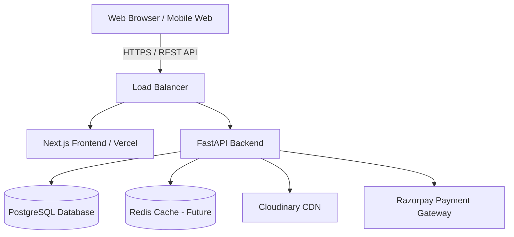

# System Architecture

The Oats Hub is designed as a scalable, high-performance monorepo integrating a modern Next.js React frontend with a robust FastAPI Python backend.

## High-Level Architecture

The system follows a classic decoupled client-server architecture:

## Core Design Principles

1. **Separation of Concerns**: The frontend handles UI, user state, and SSR/SSG. The backend is strictly an API providing business logic and data persistence.
2. **Stateless Backend**: The API is completely stateless. Authentication is handled via JWT tokens, allowing the backend to horizontally scale across multiple instances seamlessly.
3. **API-First Design**: The backend exposes a RESTful API with strict Pydantic schemas. Swagger/OpenAPI documentation is auto-generated.
4. **Layered Back-End Architecture**: Follows a strict Service-Repository pattern to isolate database operations from business logic.
5. **Component-Driven Front-End**: Utilizes reusable UI components (shadcn/ui) and feature-sliced structures.

## Monorepo Strategy

The repository is structured as a monorepo for easier management of full-stack features:
- `frontend/`: Contains the Next.js application.
- `backend/`: Contains the FastAPI application.

*Note: In production, these are deployed as separate services. Vercel for the frontend, and a containerized PaaS (like AWS ECS or Render) for the backend.*

## Commerce Architecture (Cart & Session)

1. **Inventory Validation**: The `CartService` is the ultimate source of truth for stock validation. It checks the current `stock_quantity` of a `ProductVariant` *before* inserting or updating any `CartItem`.
2. **Session Commerce**: The `Cart` model implements dual-identity tracking (`user_id` and `session_id`). This permits anonymous guest carts that can be seamlessly merged into a `user_id` upon login.
3. **Optimistic UI**: The frontend utilizes `TanStack Query`'s `useMutation` to trigger immediate UI updates via cache manipulation (`setQueryData`) when cart operations succeed, eliminating perceived network latency.
4. **Cart Lifecycle**: Carts are long-lived and soft-deleted upon successful checkout, creating a historical record of intent.
